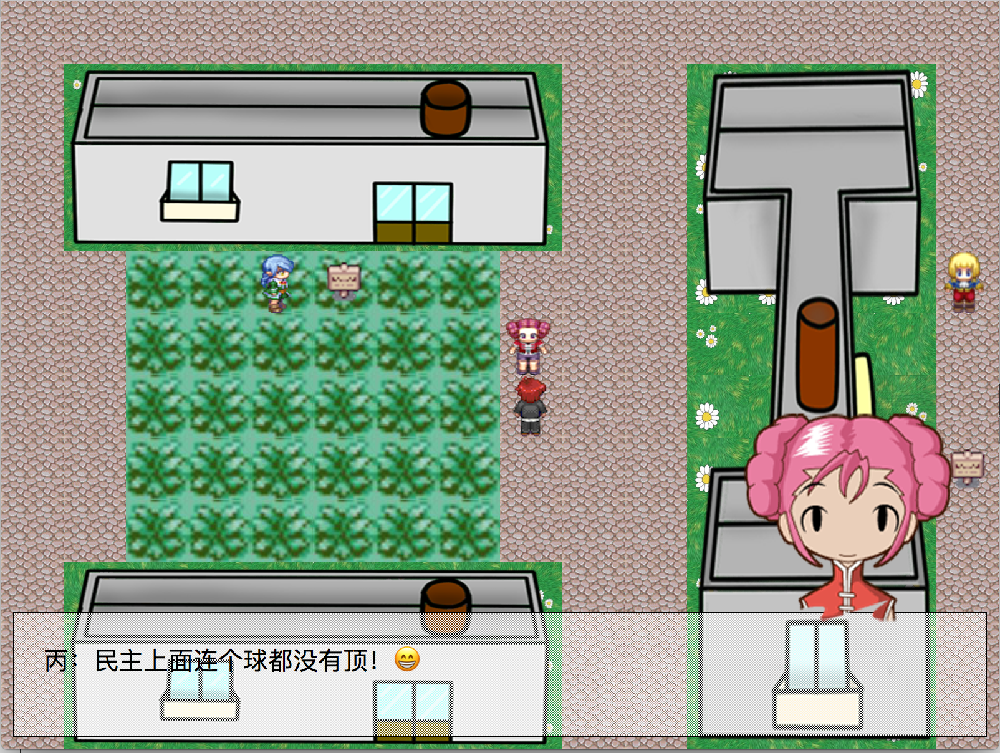
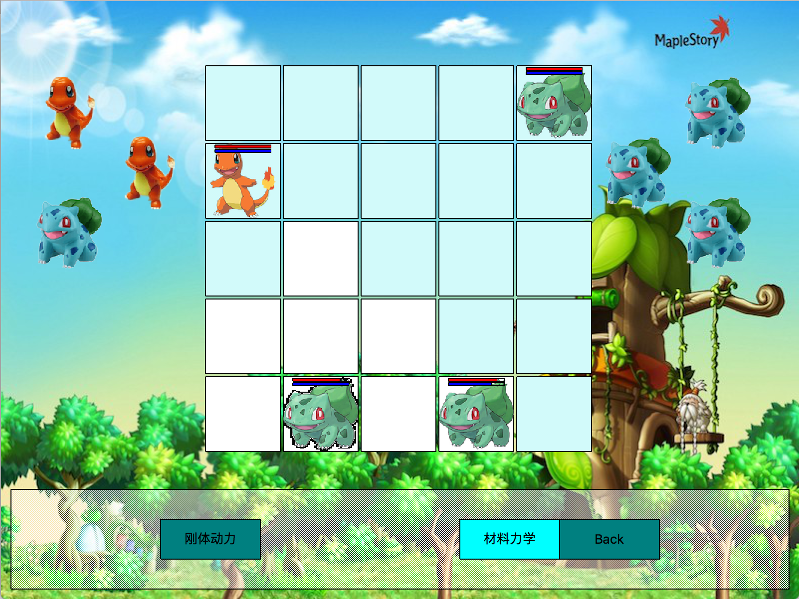
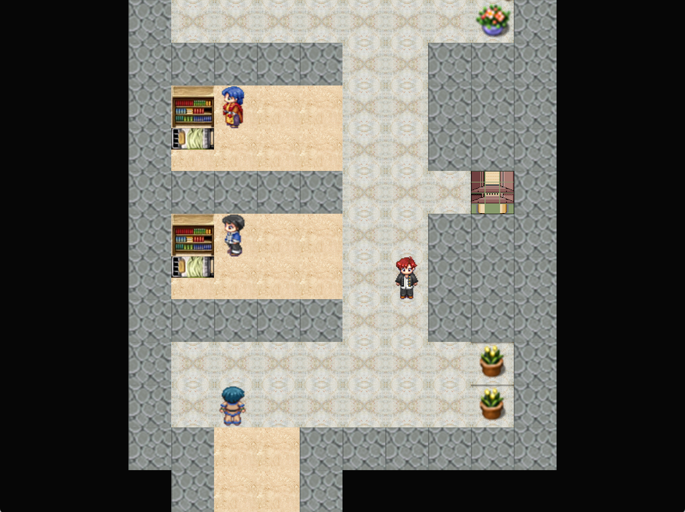
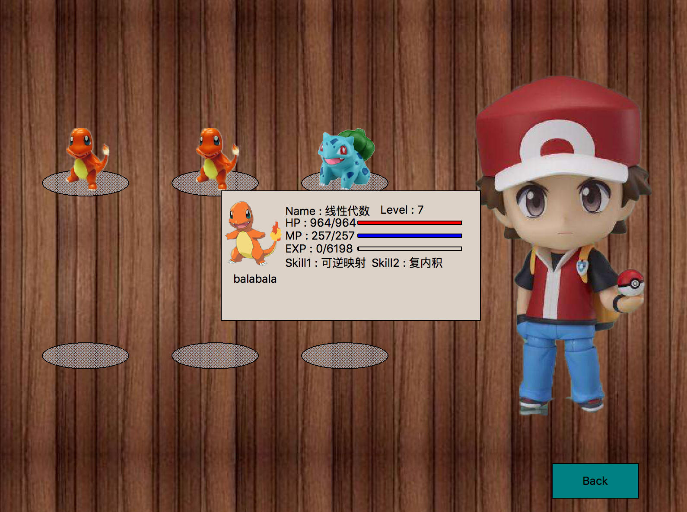

# Peking-Monster
This is a 2D RPG game written in C++ using [Qt](https://www.qt.io/) framework. It is a final project done by four students for the course "Intro to C++" at Peking University during 09/01/2016 and 01/17/2017.

----------------------------------------------------
# Introduction
The game is inspired by the classic Pokemon game. The map layout, monster image and some of the BGMs are all copied from Pokemon (of course we don't have the copyright, and the game is only for private use.) We did make some variations in terms of the battling pattern. We combined the idea of the chess game and the pokemon's "skill throwing patern", and added some artificial intelligence for the computer strategy. 

----------------------------------------------------
# Scenario
The story is designed to happen in Peking University, where you use your monsters (which is named after the courses you're taking) to fight the wild monsters (some problems or puzzles) and your enemies (other students). The goal for the game is to graduate after defeating the professsors, but due to the limited time we didn't reach that point. Other designs like adding various modules like exercising, studying, food etc. were under consideration but weren't added either. 

----------------------------------------------------
# Team member
1. Chenkai Mao: I mainly coded all the visualization part, including "battlescene", "mainscene", "scene0", "players", "gates", "button", "dialogue" etc.
2. Hongcheng Li: The AI part for the computer strategy, database. Coded "AIDecision", "Battle", "Constant", "gameenemy", "People", "PKmon", "skill" etc.
3. Yunyan Zhang: Implementation of the frame work, image and stuff design. Implemented "scene1" ~ "scene10".
4. Borong Jiao: All the other remaining tasks. (Which actually means not so much.)

